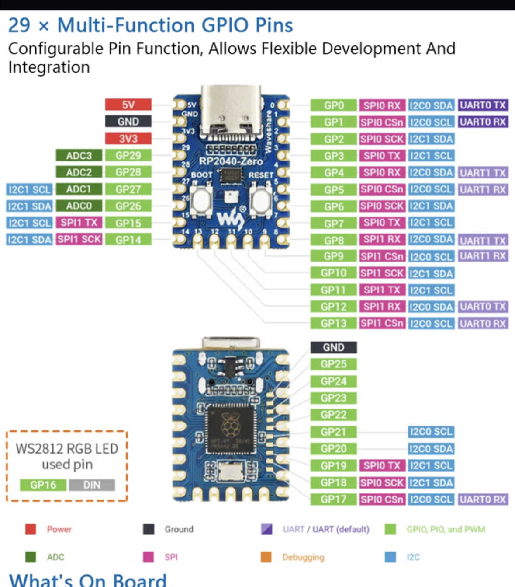

# Brief Description

following the youtube [pi pico tutorial](https://www.youtube.com/watch?v=Ic4ExTusoTw&t=1344s)

Code is copied from the [course page](https://core-electronics.com.au/courses/raspberry-pi-pico-workshop/#1.1)

- [ ] download [install pico zero](https://picozero.readthedocs.io/en/latest/gettingstarted.html)

## RP Zero Pin out

